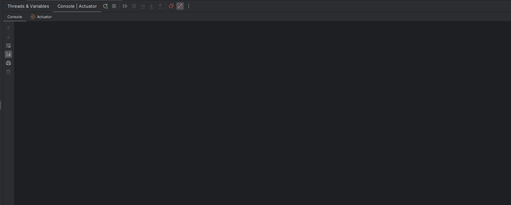

# How to use the Ollama Java Client Spring Boot Starter

## Steps:

1. Create an Spring Boot 3 project
2. Add the following dependency to the `pom.xml` file:

```xml

<dependency>
    <groupId>es.omarall</groupId>
    <artifactId>ollama-java-client-starter</artifactId>
    <version>1.0-SNAPSHOT</version>
</dependency>
```

3. Add the required properties to the `application.properties` or `application.yml` file:

```yaml
ollama:
  base-url: 'http://localhost:11434'
  call-timeout: 0
  connect-timeout: 0
  read-timeout: 0
  write-timeout: 0
```

4. Now you could inject the `OllamaService` bean in any bean of your application:

```java
    @Bean
    ApplicationRunner runner(OllamaService ollamaService,SimpleStringStreamResponseProcessor streamResponseProcessor){
            return args->{

            // Embedding request
            EmbeddingResponse embeddingResponse=ollamaService.embed(EmbeddingRequest.builder()
            .model(MODEL_NAME)
            .prompt("Dare to embed this text?")
            .build());
            log.info("******* Ollama Embedding response: {}",embeddingResponse.getEmbedding());

            log.info("******* (wait for it)");

            // Completion request
            Arrays.asList("What is the capital city of Spain?",
            "Translate this text to Spanish: 'I love cookies!'")
            .forEach(prompt->{
            CompletionResponse response=ollamaService.completion(CompletionRequest.builder()
            .model(MODEL_NAME).prompt(prompt).build());
            log.info("******* Ollama Completion response: {}",response.getResponse());
            });

            // Streaming completion
            ollamaService.streamingCompletion(CompletionRequest.builder()
            .model(MODEL_NAME)
            .prompt("What is the meaning of life?")
            .build(),streamResponseProcessor);

            };
            }
```

5. Run it:
   Install Ollama and the Mistral 7b model as stated [here](../pom.xml) and run the application:

```bash
mvn spring-boot:run
```

